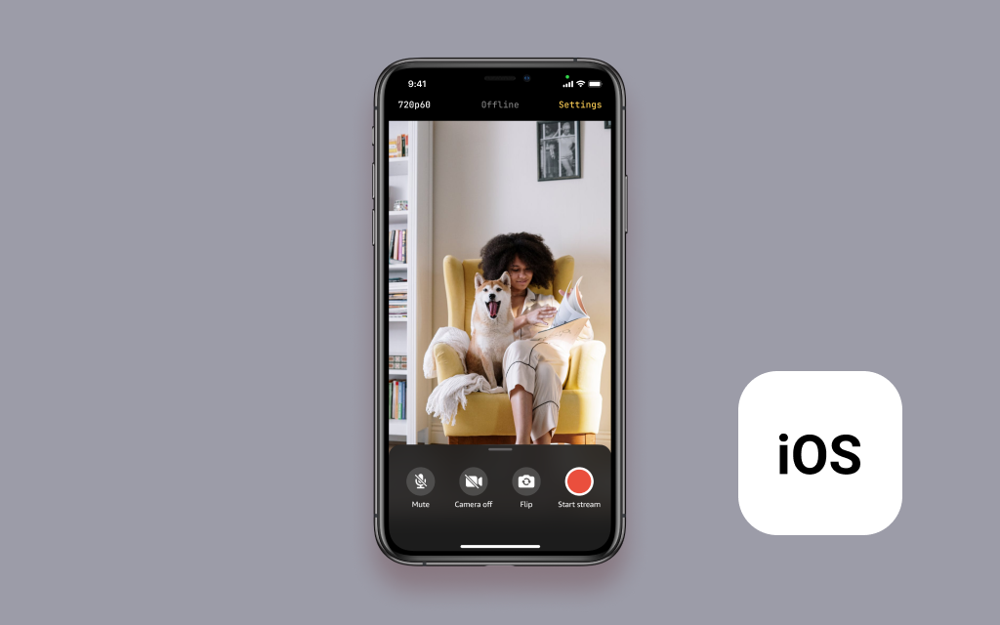

# Amazon IVS Broadcast for iOS Demo

This repository contains a demo app, which shows how to use the Amazon IVS Broadcast SDK to create a mobile streaming app on iOS using SwiftUI.

## Setup

1. Clone the repository to your local machine.
2. Ensure you are using a supported version of Ruby, as [the version included with macOS is deprecated](https://developer.apple.com/documentation/macos-release-notes/macos-catalina-10_15-release-notes#Scripting-Language-Runtimes). This repository is tested with the version in [`.ruby-version`](./.ruby-version), which can be used automatically with [rbenv](https://github.com/rbenv/rbenv#installation).
3. Install the SDK dependency using CocoaPods. This can be done by running the following commands from the repository folder:
   * `pod install`
   * For more information about these commands, see [Bundler](https://bundler.io/) and [CocoaPods](https://guides.cocoapods.org/using/getting-started.html).
4. Open `Broadcasting.xcworkspace`.
5. Since the simulator doesn't support the use of cameras or ReplayKit, there are a couple changes you need to make before building and running the app on a physical device.
    1. Have an active Apple Developer account in order to build to physical devices.
    2. Modify the Bundle Identifier for both `Broadcasting` and `ReplayKitBroadcaster` targets.
    3. Choose a Team for both targets.
    4. Create a new App Group ID based on your new Bundle Identifier for both targets, and include the targets in only that App Group.
    5. Modify `appGroupName` (can be found in `Helpers/Constants.swift`) to use your newly created App Group ID.
6. (Optional)* Refer to the [Streaming to Amazon IVS](#streaming-to-amazon-ivs) section of this readme to set up the app for streaming.
7. You can now build and run the projects on a device.

*You can run and build this app without an Amazon IVS Channel, but you will need an Amazon IVS Channel in order to start broadcasting.

## Streaming to Amazon IVS

### Prerequisites

**IMPORTANT NOTE:** Using your own stream will create and consume AWS resources, which will cost money.

1. Create and set up an Amazon IVS channel. A guide is available here: [Getting started with Amazon IVS](https://docs.aws.amazon.com/ivs/latest/userguide/GSIVS.html).

### Referencing your stream in the app

1. Open the [Amazon IVS Console](https://console.aws.amazon.com/ivs) and navigate to the channel you would like to use.
2. Open `Helpers/Constants.swift` and find lines 16 - 18.
3. Copy the _Ingest Server_ for the channel and paste it into the `ingestServer` field on line 16 between the quotes. The resulting line should look like the following: `static let ingestServer = "rtmps://<ingest_server_url>:443/app/"`
4. Copy the _Stream Key_ for the channel and paste it into the `streamKey` field on line 17 between the quotes.
5. Copy the _Playback URL_ for the channel and paste it into the `playbackUrl` field on line 18 between the quotes.
6. Save and run the application.

You can also change the values for any of these fields in the app settings once you have launched the app on a physical iPhone.

## Known Issues
- This app has only been tested on devices running iOS 14 or later. While this app may work on devices running older versions of iOS, it has not been tested on them.

## More Documentation

+ [Amazon IVS iOS Broadcast SDK Guide](https://docs.aws.amazon.com/ivs/latest/userguide/broadcast-ios.html)
+ [More code samples and demos](https://www.ivs.rocks/examples)

## License
This project is licensed under the MIT-0 License. See the LICENSE file.
